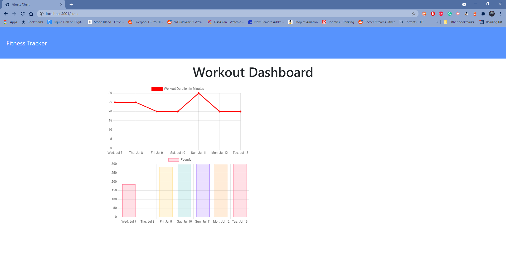
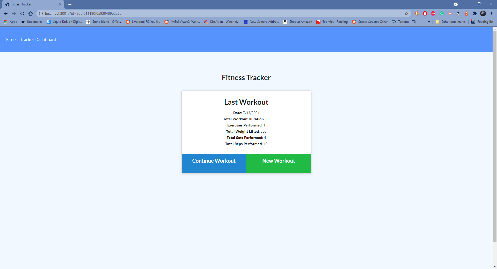

# fit-tracker
MIT 

## Description
 An Application that allows its users to easily enter and track their workout process.
  
  ## Table of contents
  - [Description](#description)
  - [Table of contents](#table-of-contents)
  - [Installation](#installation)
  - [Images](#image)
  - [heroku](#youtube)
  - [Technologies](#technologies)
  - [License](#license)
  - [Contributing](#contributing)
  - [Questions](#questions)

## Installation

## Images 
 fit tracker gif: 

## heroku 

https://fitness-tracker44.herokuapp.com/

# Technologies 
  -  express
  - mongoose
  - morgan

## License MIT
I have used a mit License for this application, please see repository for documentation <https://github.com/anthony9292/Team-Generator-/blob/main/License.md>

## Contributing
   anthony9292

## Questions
For questions regarding this application please contact me at:
- E-mail anthon.n08@gmail.com 
- Github:<https://github.com/anthony9292>

    
